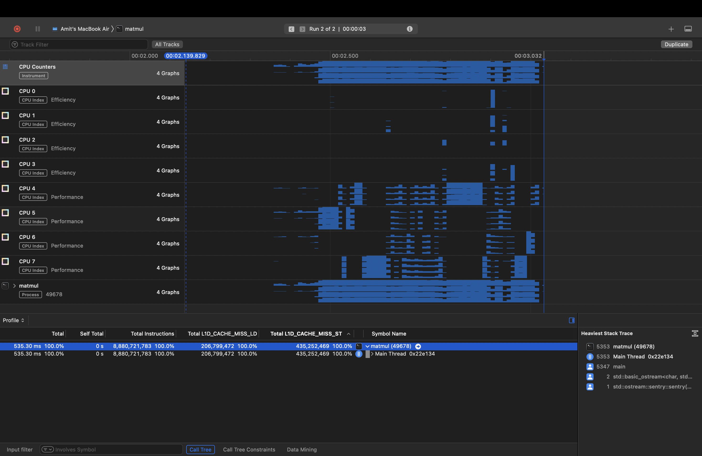
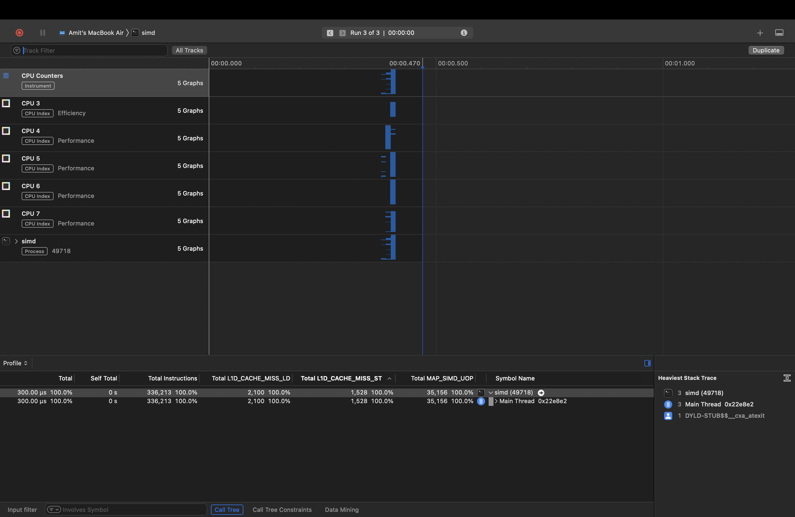
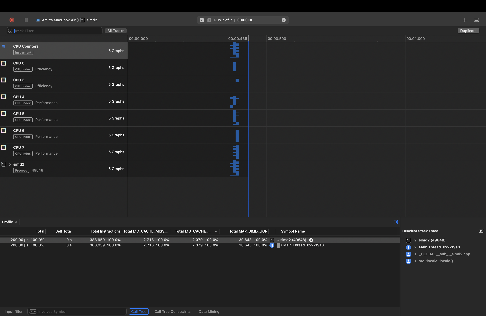
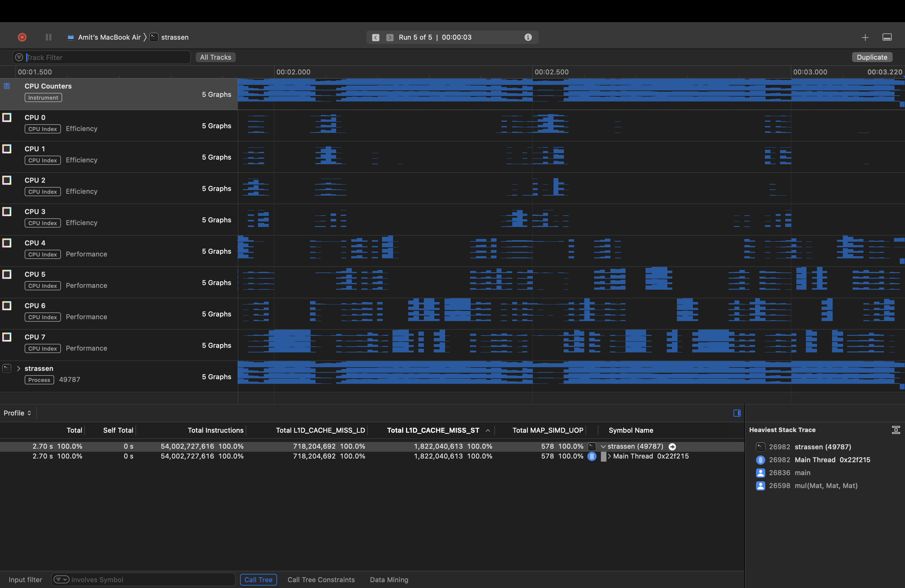
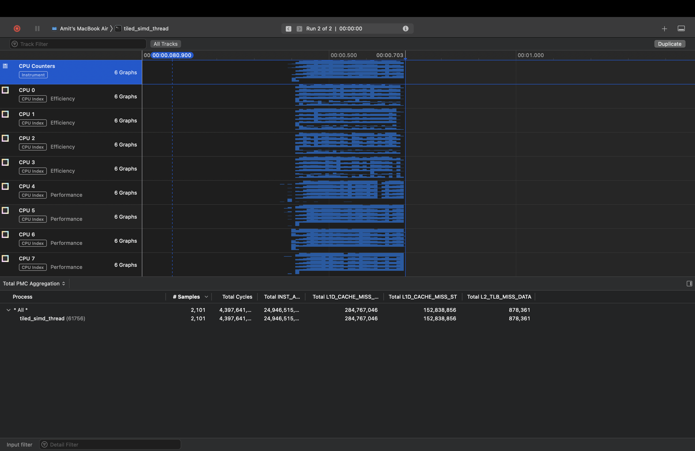

# ACA Assignment Report (20222021013)

## Methodology

The first question concerns vector instructions, for the intrinsic functions are in the `arm_neon` header file. The simd.cpp and simd2.cpp hold the code for the sub-questions (a),(b) and (c).

For the second question the files matmul.cpp, strassens.cpp and tiled_thread.cpp, tiled_simd_thread.cpp have the codes of the three questions. Strassens is not done in a fully recursive manner because the overhead of allocating auxillary space for the intermediate results vastly outweighs its asymptotic benefit, plus its cache performance is terrible. So just a single level of strassens is used(i.e. same algorithm is not used for intermediate multiplications)

The tiled matrix multiplication is performed in many ways, one is a single threaded code while the rest use a threadpool and vector instructions for the dot product.

## Findings

### Results

Results for Question 2:

| Algorithm                                   | time taken (µs) |
|---------------------------------------------|-------|
| simple matrix multiplication                | 10819688   |
| strassens                                   | 2472653    |
| tiled                                       | 22175463   |

Results for Multithreaded Tiled Vectorized

| Tile Size  | time taken (µs) |
|------------|------------|
| 4          | 680988    |
| 8          | 312031    |
| 16         | 298572    |
| 32         | 301732    |
| 64         | 291732    |
| 128        | 291921    |
| 256        | 289690    |
| 512        | 315106    |
| 1024       | 311217    |
| 2048       | 1372273   |

### Analysis

The results in the file output.txt clearly show the differences in the execution time due to cache locality. The file contains the times for all permutations of the simple triple loop matrix multiplication operation. The best one is the (i k j), the reason being the variable that changes most frequently (j) does so on the horizontal axis, cause all accesses being from adjecent cells, which means more cache hits.

For the tiled version of the code the optimal tile size turns out to have a inverse relation with the tile size, as the tile size size reduces the number of consecutive memory location accesse reduce, which traslates to more misses and higher times. The best times are where the tile size is 1024.

The multithreaded code clearly gives the best timing, making use of the core specific L1 cache parallelly. 

## Images

Include images to support your findings. Use the following syntax for embedding images:

CPU counters for matrix simple multiplication

CPU counters for vectorized instructions

CPU counters for vectorized instructions

CPU counters for strassens

CPU counters for tiled threaded matrix multiplication

